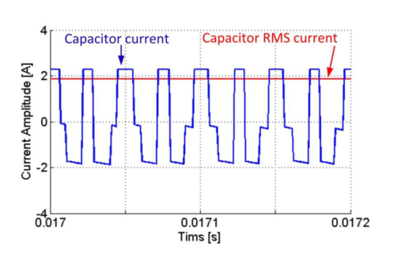

# Power Fluctuation
## Single-phase system

* First part is time invarient real power
* Second part is time-varying fluctuating power
* Frequency is twice the fundamental
* Capacitors must be large

## Three-phase system

* Instantaneous power is equal to real power
* No fluctuating power
* Reactive power of each phase is balanced by the other two phases
* Capacitors are small (only ripple frequency at kHz level)

# Capacitor Datasheet Evaluation
Ref: http://www.farnell.com/datasheets/1849766.pdf
http://tr.farnell.com/epcos/b43564a5109m000/cap-alu-elec-10000uf-450v-screw/dp/2283985
EPCOS, aluminium electrolytic capacitor
* Vr: Rated voltage
* Vs: Surge voltage (around 1.15xVr)
* Cr: Rated capacitance
* Capacitance tolerance
* Iac,r: Ripple RMS current (affected by temperature, frequency)
* ESR: Equivalent series resistance (affected by temperature, frequency)
* ESL: Equivalent series inductance (affected by dimension, around 20 nH)
* Lifetime: Affected by temperature, Iac,r
* Dimensions (D,L), volume, surface area and weight

# Capacitor Analysis
## Parameters for DC link Capacitors
* RMS current
* DC voltage
* Ripple voltage: capacitance
* Switching frequency
* ESR: loss, heat, lifetime
* ESL: voltage overshoot
* Inductor of filter (effect of rectifier side)

# Capacitor Types
## Aluminium electrolytic capacitor
* ++ High capacitance per volume
* ++ Low cost
* ++ Suitable for vibrational environment
* -- Sensitive to temperature change
* -- Low RMS current rating per volume
## Polypropylene film capacitor
* ++ High RMS current rating per volume
* ++ Small ESL
* ++ Better temperature stability
* ++ Suitable for vibrational environment
* -- Low capacitance per volume
* -- High cost
## Multi-layer ceramic capacitor (MLCC)
* ++ Low cost
* ++ High RMS current rating per volume
* -- Low capacitance per volume
* -- No self-healing capability
* -- Limited power rating (multiple series and parallel capacitors)

## Typical capacitor current in a motor drive

