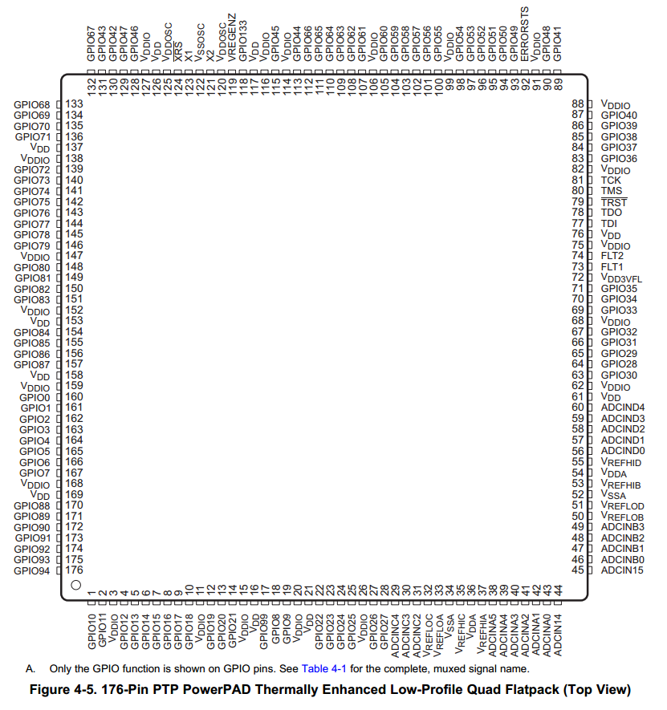
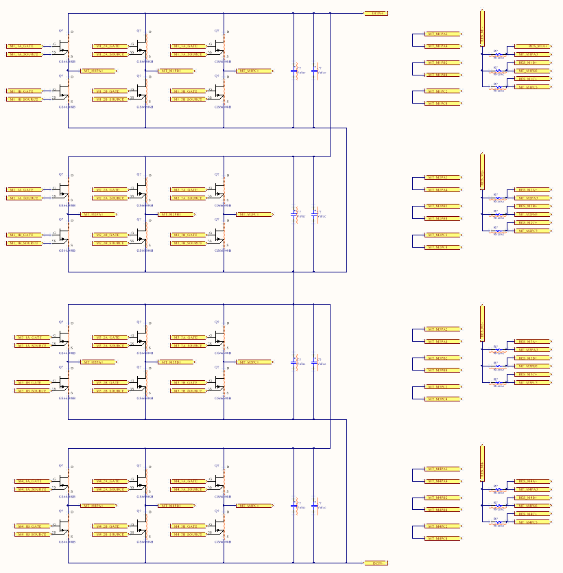

##### In this file, the procedure for the PCB design of the IMMD system for BAP project will be explained.

##### Schematic files:
1. Main: All the interconnections of the sub-modules and connections with the outside.
2. Rectifier: The rectifier circuit including diode bridge rectifier, the filter inductor and DC bus filter capacitor.
3. Power stage: Motor drive inverter power stage with GaN FETs.
4. Control: The control circuit including microcontrollers.
5. Measurement: Position measurement (common) and current measurement for all the modules.
6. Gate drive: The gate drive circuitry for GAN FETS.
7. Power supply: The auxiliary supply for the PCB.

##### Rectifier
http://tr.farnell.com/vishay/vs-26mt100/bridge-rectifier-25a-3ph/dp/9098550
http://www.farnell.com/datasheets/2049266.pdf

The rectifier packages are not suitable for PCB mount, so they will be mounted to a chasis along with a separate heat sink. In fact, all the rectifier circuit may be a separate unit outside the IMMD system.

##### Controller
TMS320F28374S	(ACTIVE)
Single-Core Delfino Microcontroller

http://www.ti.com/product/tms320f28374s

176 pin version, SMD mount, 24mmX24mm, TMS320F28374SPTPS, HLQFP
200 MHz, 3 CPU timers 4 SCI, 3 SPI, 16 HRePWM, 24 ePWM, 3 DAC, 20 channel 12-bit ADC, 97 GPIO

The frequency and ADC resolution (and conversion time) are questionable.

We are lucky that it has the same footprint with the F28335 device. Thermal PAD is questionable.

Pin diagram: 

https://www.digikey.com/products/en?mpart=TMS320F28377SPTPS&v=296

S corresponds to single-core. We shall not need dual core MCU.

Launchpad (377S): http://www.ti.com/tool/LAUNCHXL-F28377S
http://tr.farnell.com/texas-instruments/launchxl-f28377s/dev-board-c2000-launchpad/dp/2483489?ost=F28377S+LaunchPad&searchView=table&iscrfnonsku=false&ddkey=http%3Atr-TR%2FElement14_Turkey%2Fsearch

374S and 377S (both PTP) have the same pin assignment, so we are OK.

First, a launchpad can be used for just proof of concept. Then, microcontroller PCB can be produced.

##### Current measurement
AMC1200 for current measurement
http://www.ti.com/lit/ds/symlink/amc1200.pdf
http://www.ti.com/lit/an/sbaa229/sbaa229.pdf
http://www.ti.com/lit/ug/sbau187a/sbau187a.pdf

##### GaN

GaN: http://www.gansystems.com/gs66508b.php

Current version of the power stage design:

##### Gate drive

Gate drive: https://www.silabs.com/documents/public/data-sheets/Si827x.pdf
Si8273
SOIC-16 NB

LP2985IM5-6.1/NOPB
SOT23

At first, non-isolated bootstrap half-bridge gate driver was studied. However, as it was used in the EVM of the selected GaN FET, isolated separate gate drivers will be used. **SI8271GB-IS**.
No negative voltage will be used. 5V will be the input to the whole gate drive circuit. +9V will be obtained via **PES1-S5-S9-M**, then it will be converted to 6V which is the gate voltage via **LP2985IM5-6.1**.

Test points will be added.

Fully isolated gate driver is the final decision.

Snubber required?

Current version of the gate drive design (1 phase of 1 module):

Chosen dead time: 50 ns. This is questionable. For a 200 MHz processor (selected), this time corresponds to 10 clock cycles. The processor dead time register should be checked for verification.

Gate resistor (turn-on) is selected as 10 Ohms for starters. Turn off is 1 Ohm. It may be increased to sustain possible oscillations. Switching loss must be calculated. The ratio (10:1) is selected to control the miller effect.

Ferrite bead (in gate) should be: Z=10-20Ω@100MHz
RC snubber across G-S will be used: R=3R3, C=220pF

For turn-off, using negative voltage (-3V) is not normally recommended. But it is good to sustain gate oscillations. The designed gate driver does not have negative bias voltage.

Kelvin source connection is used to minimize path inductance.
