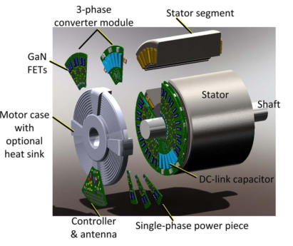
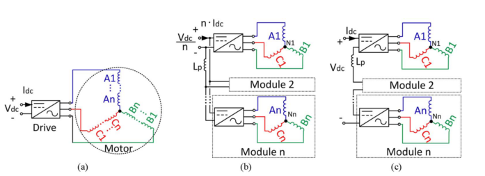
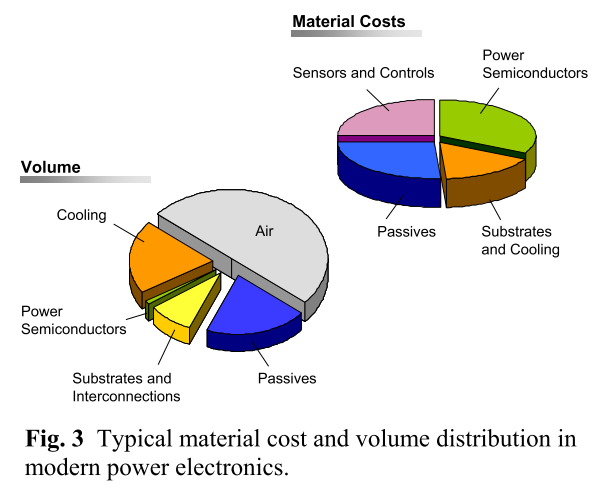
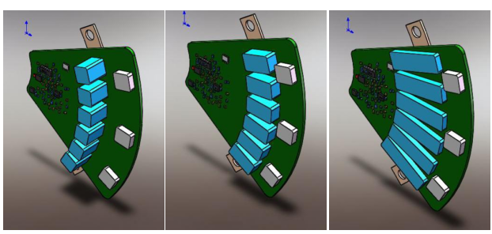

# Optimization of DC Link Capacitors in Integrated Modular Motor Drives

## Abstract
In this research work, selection of optimum DC link capacitor for Integrated Modular Motor Drives (IMMD) is achieved. First, a review of IMMD technologies is performed and current research and future prospects are studied. Challenges of the IMMD technologies are discussed. Inverter topologies and gate drive techniques are evaluated in terms of DC link performance. DC Link capacitor types are discussed and critical aspects in selecting the DC links capacitor are listed. Analytical modeling of DC link capacitor parameters is performed and it is verified by simulations conducted using MATLAB/Simulink. Optimization of DC link capacitor is achieved based on the model, capacitor selection algorithm and simulation results.

## Keywords
integrated modular motor drive; split winding motor; DC Link capacitor; interleaving; GaN transistor

## Introduction

Electric motor drives constitute nearly 45 % of global electricity usage [ref]. Presently, most of the electric energy is generated by means of fossil fuels which means that increase in energy efficiency in motor drive systems will yield not only economical but also environmental benefits.

In conventional motor drive systems, drive units are placed in a cabinet and connected to the motor by means of long cables. Placing the motor and its drive separately increases to the volume and weight of the system decreasing the system power density. In applications such as aerospace or electric traction where motor drives are fundamental elements, power density plays an important role in the design.

In addition, due to the long connection cables, high voltage transients on the motor windings caused by PWM operation occurs on the motor terminals causing leakage currents through stator winding insulation. This effect leads to aging of insulations and shortening of motor lifetime. One measure for this effect is the utilization of filters between motor drive and inverters which is a bulky and costly solution.

In recent years, a new concept called Integrated Modular Motor Drives (IMMDs) has emerged to overcome the aforementioned problems. This concept suggests that, the drive stage of a motor drive system including power stage, control electronics, passive elements and heatsink can be integrated to the motor resulting in a single integrated unit. This integration phenomena brings several advantages. The power density of the motor drive system is significantly incrased. furthermore, the long cables are eliminated so that the lifetime of the motor is increased and EMI problems are minimized. In addition, this concept aims to modularize the overall system, dividing it into several identical parts. Winding terminals of the motor poles are taken out separately to be driven by its own power electronics. By this way, a motor drive system is composed of a number of identical modules sharing the total power requirement equally. This technique significantly incrases the fault tolerance of the motor and drive as the motor can continue its operation even if a fault occurs on one of the modules. Moreover, the voltage stress on each module and motor winding group is reduced which also enables the utilization of power semiconductor devices with low breakdown voltage ratings. The thermal performance of the drive is also improved as the heat sources in the system are now distributed on a larger surface area, and hot spot temperatures are reduced. In addition, fabrication, installation, maintenance and repairment costs are also drastically reduced thanks to the modular structure.

Alongside of these benefits, integration of the motor and drive brings about several challenges to the designer. First of all, fitting all the drive componenets to such a small footprint requires size optimization and optimum placement of components. Moreover, cooling of motor and drive simultaneously is very difficult. In addition, the electronics is directly subjected to the physical vibration caused by the motor. To reduce the size of passive elements, incrasing the operation frequency by the utilization of new generation wide bandgap power semiconductors is proposed. Because of that, parasitic inductances on both power stage and gate drive circuitry become more significant which requires careful layout design.

All these challenges imply new research opportunities.

Bizim önerdiğimiz yeniliklerden bahsedecek miyiz???

## IMMD Technology Review

* Concept of IMMD

Buraya bir-iki görsel gelecek (referans)

Yukarıda yazan kısımların bir kısmı buraya alınacak.

* Modular Motor with Split Winding

In a conventional motor, the stator coils in different poles are usually connected in series forming a single winding for each phase. In a modular motor design, these pole windings can be connected to separate drive inverters. such kind of machines are called split winding machines. This technique can be visualised in Figure.

Figür yeniden çizilecek.

End winding cost and losses will decrease.

* IMMD topologies

Connection of the inverters in parallel or series on the DC link in a variety of combinations is easy without the practical concerns related to circulating currents between inverters, since the load side is inherently isolated due to split winding machine configuration.

With modular machine, the voltage level on each segment will be small supposing that the total number of turns is preserved. Presence of a high voltage on DC link will require some sort of series connection of converters or power switches in a multilevel structure for full utilization. In addition, keeping the voltage level of each inverter module small will lead to the possibility of utilizing low voltage power semiconductors. This will surely enable new generation high electron mobility transistors (HEMT) such as Gallium Nitride (GaN). Furthermore, it is known fact that, reduction of the voltage rating of each power device yields a reduction on the switching losses of the overall system.

Many multilevel converter topologies have been proposed in the literature. The most common ones are Neutral Point Clamped (NPC), Flying Capacitor (FLC), Cascaded H-Bridge (CHB) and Modular Multilevel Converter (MMC) which are shown in Figure. Comparison of these topologies for use in IMMD applications in terms of componenet quantity, componenet sizing, voltage stress etc. has been studied several times.

The major drawback of topologies having series connection is reduced tolerance to the faults. One of the main ideas behind modularity is to boost the fault tolerance of the system, so it is not wise to use a fully series connected topology.

Figür gelcek. Yeniden çizilecek.

It is also possible to construct a topology by just simply connecting several 3-phase 2-level modules, each of which is responsible for one motor winding module, in series and parallel according to the need for voltage and current sharing as shown in Figure.

Yeniden çizilecek.

This type of topology has the advantage of flexibility in the design, absolute symmetry, redundancy and better fault tolerance on drive stage. The simple structure also eliminates the need of any additional circuit components.

The number of series connected modules can be decided by the relation between DC link voltage level and power semiconductor voltage ratings.

* Wide Bandgap Power Semiconductor Devices

YAZ.

## DC Link Modeling

Recduction of DC link capacitor volume is very crutial in IMMD design. As seen in the figure, in a modern power electronics system, passive elements take a significant portion of overall volume and cost
(Marz, 2010).

Decresing the volume of capacitors is not sufficient alone, the height of the capacitors should also be minimized.

* Analytical Modeling

* Effect of Interleaving

## DC Link Capacitor Evaluation

* Types of Capacitors

The most common capacitor types used in motor drives are aluminum electrolytic capacitors, metal film capacitors and multilayer ceramic capacitors.

# Capacitor Types
## Aluminium electrolytic capacitor
* ++ High capacitance per volume
* ++ Low cost
* ++ Suitable for vibrational environment
* -- Sensitive to temperature change
* -- Low RMS current rating per volume

## Polypropylene film capacitor
* ++ High RMS current rating per volume
* ++ Small ESL
* ++ Better temperature stability
* ++ Suitable for vibrational environment
* -- Low capacitance per volume
* -- High cost

## Multi-layer ceramic capacitor (MLCC)
* ++ Low cost
* ++ High RMS current rating per volume
* -- Low capacitance per volume
* -- No self-healing capability
* -- Limited power rating (multiple series and parallel capacitors)

* Capacitor Selection Aspects

In motor drives, DC link capacitors have the function of taking on the power fluctuation on the DC link occuring at two or six times the msupply frequency (depending on the number of phases), supplying the current ripples at the inverter switching frequency, to avoid the injection of high frequency ripples from one side to the other in the back-to-back structure (decoupling), to provide the drive system for a while in case of power shutdown, to supply the transient powers etc.

* Capacitor Selection Algorithm

## Results

## Conclusions

## Acknowledgements

## References
1.	T. Morita et al., “99.3% Efficiency of three-phase inverter for motor drive using GaN-based gate injection transistors,” Conf. Proc. - IEEE Appl. Power Electron. Conf. Expo. - APEC, pp. 481–484, 2011.
2.	J. J. Wolmarans, M. B. Gerber, H. Polinder, S. W. H. De Haan, J. A. Ferreira, and D. Clarenbach, “A 50kW integrated fault tolerant permanent magnet machine and motor drive,” PESC Rec. - IEEE Annu. Power Electron. Spec. Conf., pp. 345–351, 2008.
3.	J. Wang, “A New Concept of Multilevel Converter Motor Drive with Modular Design and Split Winding Machine,” 2014.
4.	G. Su, “A Segmented Drive Inverter Topology with a Small DC Bus Capacitor,” Energy, pp. 2847–2853, 2010.
5.	N. Bianchi and M. Dai Pre, “Analytical calculation of the RMS current stress on the DC-link capacitor of voltage-PWM converter systems,” IEE Proceedings-Electric Power Appl., vol. 150, no. 2, pp. 139–145, 2003.
6.	M. D. Hennen, M. Niessen, C. Heyers, H. J. Brauer, and R. W. De Doncker, “Development and control of an integrated and distributed inverter for a fault tolerant five-phase switched reluctance traction drive,” IEEE Trans. Power Electron., vol. 27, no. 2, pp. 547–554, 2012.
7.	J. Wang, Y. Li, and Y. Han, “Evaluation and design for an integrated modular motor drive (IMMD) with GaN devices,” 2013 IEEE Energy Convers. Congr. Expo. ECCE 2013, no. Immd, pp. 4318–4325, 2013.
8.	T. M. Jahns, “Hardware Integratio on for an Integrated Mod dular Motor Drive Incl luding Distributed Contr rol,” pp. 4881–4887, 2014.
9.	D. Zhang, F. Wang, R. Burgos, R. Lai, and D. Boroyevich, “Impact of interleaving on AC passive components of paralleled three-phase voltage-source converters,” IEEE Trans. Ind. Appl., vol. 46, no. 3, pp. 1042–1054, 2010.
10.	S. M. Lambert, B. C. Mecrow, R. Abebe, G. Vakil, and C. M. Johnson, “Integrated Drives for Transport - A Review of the Enabling Electronics Technology,” IEEE Veh. Power Propuls. Conf., pp. 1–6, 2015.
11.	S. M. Lambert, B. C. Mecrow, R. Abebe, G. Vakil, and C. M. Johnson, “Integrated Drives for Transport - A review of the enabling thermal management technology,” IEEE Veh. Power Propuls. Conf., pp. 1–6, 2015.
12.	J. Wang, Y. Li, and Y. Han, “Integrated Modular Motor Drive Design With GaN Power FETs,” IEEE Trans. Ind. Appl., vol. 51, no. c, pp. 3198–3207, 2015.
13.	L. Calzo, “Mecrow , Barrie ( 2016 ) Integrated motor drives : state of the art and future trends . IET Electric Power Applications,” 2016.
14.	N. R. Brown, T. M. Jahns, and R. D. Lorenz, “Power Converter Design for an Integrated Modular Motor Drive,” Ind. Appl. Conf. 2007. 42nd IAS Annu. Meet. Conf. Rec. 2007 IEEE, pp. 1322–1328, 2007.
15.	Galassini, A. Costabeber, C. Gerada, G. Buticchi, and D. Barater, “State space model of a modular speed-drooped system for high reliability integrated modular motor drives,” Electr. Syst. Aircraft, Railw. Sh. Propulsion, ESARS, vol. 2015–May, 2015.
