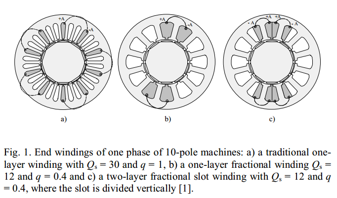
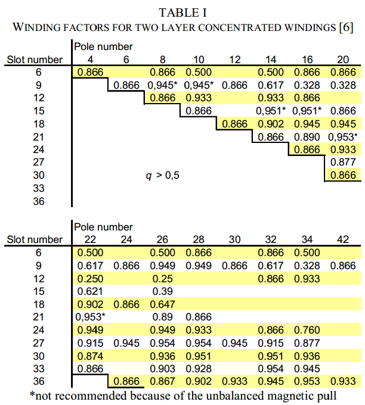
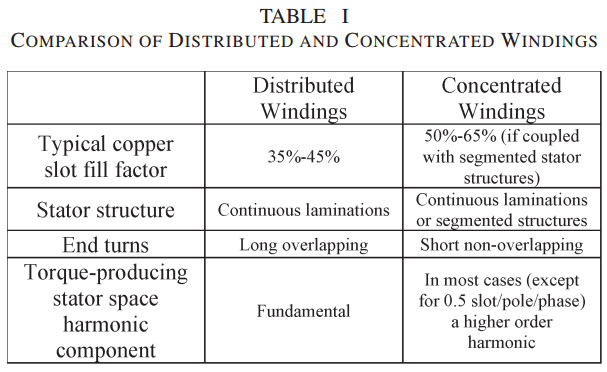
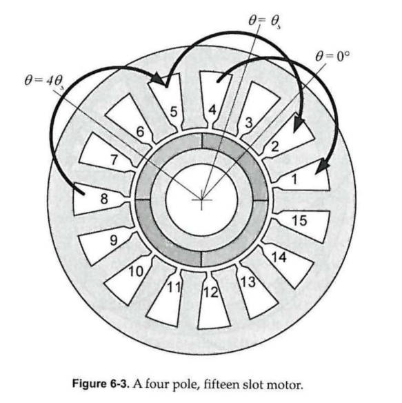
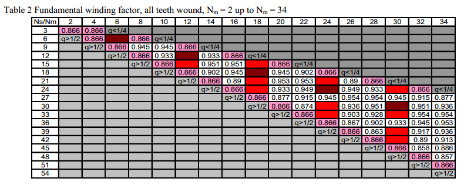
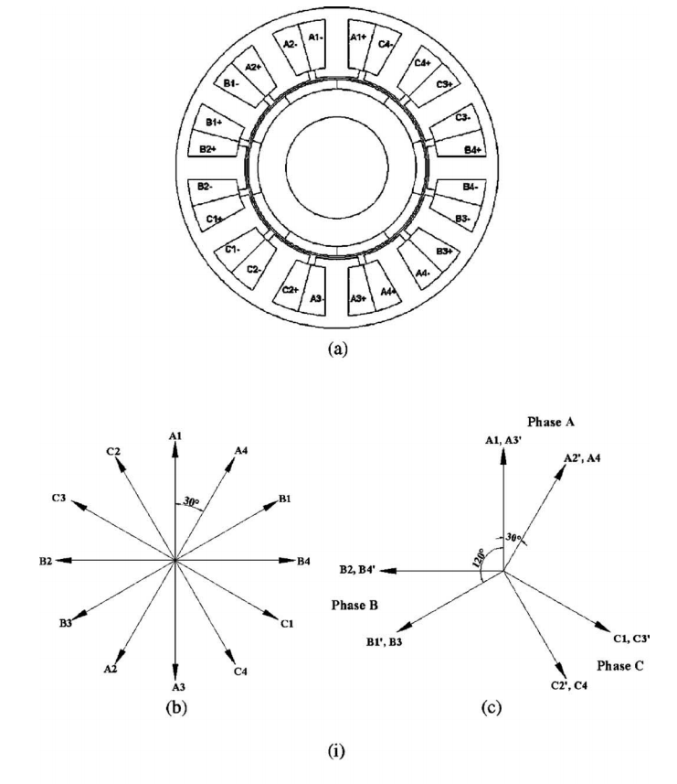
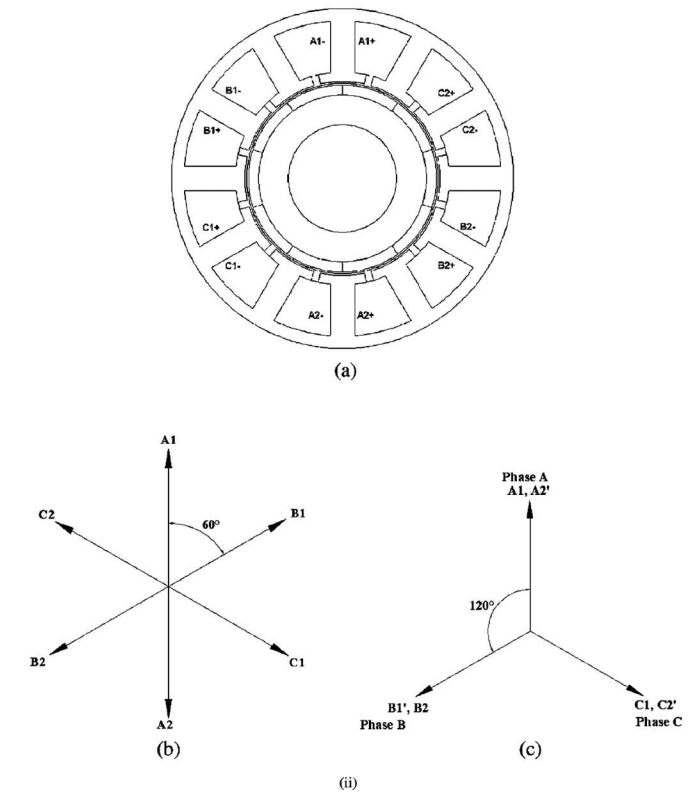
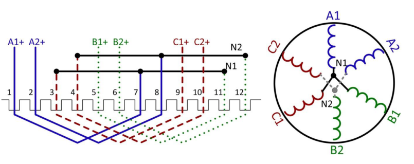
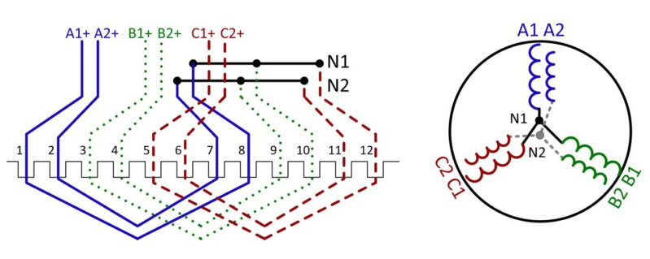

## Fractional slot concentrated winding (FSCW) PM-BLDC machines

**Fractional Slot Concentrated Windings: A New Method to
Manage the Mutual Inductance between Phases in Three-Phase
Electrical Machines and Multi-Star Electrical Machines**

With concentrated windings, a new degree of freedom appears; the configuration—number of slots/number of poles—can have a positive impact.

FSCW structure involves a lot of magnetic field harmonics in the airgap, which is not the best situation regarding the iron loss mitigation or the production of torque.

They are able to provide machines with short axial length.

The magnetic field harmonics can be reduced by numerous methods. The first one is the use of double layer windings which destroys many harmonics and reduces others. If this is not enough, the second solution is in using q = 0.5 which destroys all the sub-harmonics.

**Guidelines for Designing Concentrated Winding Fractional Slot Permanent Magnet Machines**

The fractional slot PM synchronous machine is inherently best suited for low speed applications.

It is easy to see that the end windings of the fractional slot concentrated windings (q ≤ ½) are notably shorter than the end windings of integral slot windings.

End windings are not overlapping each other.

**Fractional-Slot Concentrated-Windings Synchronous Permanent Magnet Machines: Opportunities and Challenges**

**Advantages** include:
* high power density
* high efficiency, short end turns
* high slot fill factor particularly  when coupled with segmented stator structures
* low cogging torque
* flux-weakening capability
* fault tolerance

One of the key **challenges of using FSCW configurations** is the significant rotor losses (including magnet losses, rotor core losses, and sleeve losses in case of conductive sleeve) particularly at high speeds due to the various sub- and superspace-harmonic components inherent to such winding configurations that are not in synchronism with the rotor.

**Brushless permanent magnet motor design (BOOK)**

**Cogging torque** describes the interaction of the rotor magnets acting on the stator teeth or poles inde- pendent of any current. While this torque is often considered beneficial in step motors, it is considered detrimental in brushless permanent magnet motors.

Simply put, cogging torque is the torque created when the rotor permanent magnets attempt to align themselves with a maxi- mum amount of ferromagnetic material.

**Phi** is the magnet flux crossing the air gap and **R** is the total reluctance through which the flux passes

Since each magnet produces cogging torque as it passes by stator slots, the relationship between **the number of magnet poles and the number of stator slots** influences cogging torque.

In **fractional slot motors** such as the four pole, fifteen slot motor, each magnet appears in a different position relative to the stator slots. As a result, the cogging torques created by all magnets are out of phase with each other, and the net cogging torque is reduced since the cogging torque from each magnet adds together and at least partially cancels the cogging torque from other magnets. This fact is one of the primary reasons for choosing a fractional slot motor.

**Coil span**:

Number of slots per magnet pole:

where Ns is the nunber of **stator slots** and Nm is the number of **rotor poles**.

Nominal coil span in slots:

where fix is the **integer portion**.

**FSCW example**

Ns = 15, Nm = 4

S* = max(fix(Ns/Nm),1)

S* = max(3,1) = 3

coil span = 3

**Relative angles and associated In and Out slots**

**Distribution, coil-span and winding factors for PM machines with concentrated windings**

**Comparison of PM Brushless Motors, Having Either All Teeth or Alternate Teeth Wound**

###### Örnek FSCW sargı konfigürasyonları (all-teeth-DL, alternate-teeth-SL)

## Split Winding machine
Conventional winding:

Split winding:

* Maintains all electrical and mechanical properties of motor
* Can be easily generated from a conventional motor
* Interconnections are eliminated
* Manufacturing is easier
* End winding size, cost and loss is reduced

In the configurations below, the stator has 2 pole pairs and 12 slots
## Split winding coils in different pole pairs (distributed)
The winding segments are located at different halves of the motor without overlapping. This

## Split winding coils in different pole pairs (concentrated)

## Split winding coils in identical pole pair (distributed)

## Split winding coils in identical pole pair (concentrated)
The split winding approach is very flexible when there are more slots per pole per phase (SPP).
All the segments have the same current and voltage ratings, but they are locating at different stator angles.
Figür hatalı olabilir

