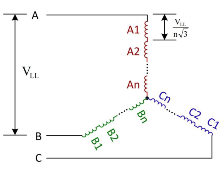
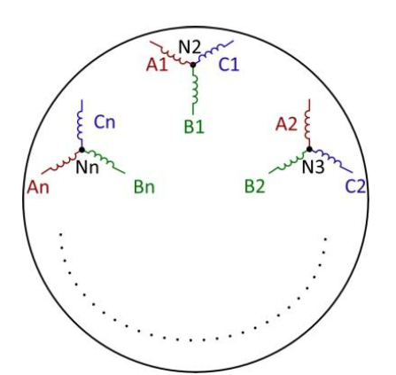

## Split Winding machine
Conventional winding:

Split winding:

* Maintains all electrical and mechanical properties of motor
* Can be easily generated from a conventional motor
* Interconnections are eliminated
* Manufacturing is easier
* End winding size, cost and loss is reduced

In the configurations below, the stator has 2 pole pairs and 12 slots
## Split winding coils in different pole pairs (distributed)
The winding segments are located at different halves of the motor without overlapping. This

## Split winding coils in different pole pairs (concentrated)

## Split winding coils in identical pole pair (distributed)

## Split winding coils in identical pole pair (concentrated)
The split winding approach is very flexible when there are more slots per pole per phase (SPP).
All the segments have the same current and voltage ratings, but they are locating at different stator angles.
Figür hatalı olabilir

