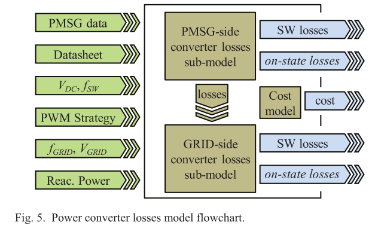
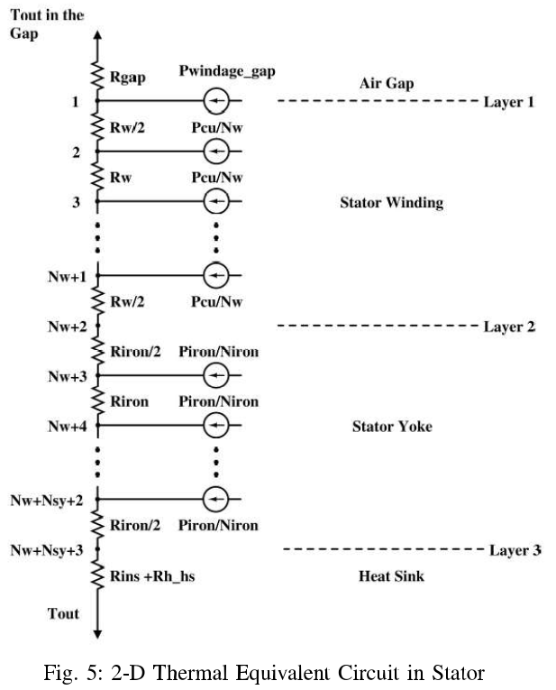
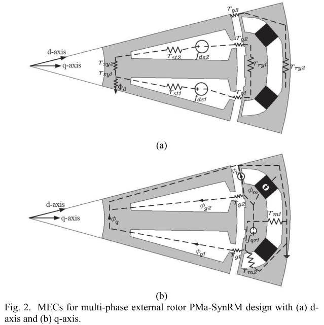
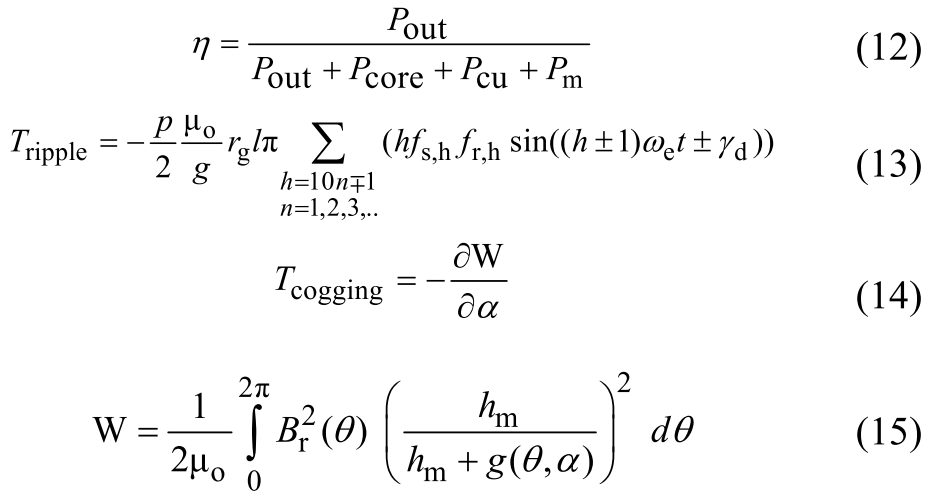

It is clear now that I do not fully understand the main phyloshopy behind an optimization :)

In this file, some deductions made from literature research on the optimization of a power converter or a motor are gathered.

It will be useful for developing the model as well as
constructing the basic structure of the final paper.

* **Ease of manufacturing**: It is very important in terms of practical aspects. It cannot be directly added to the developed program. However, some constraints (boundaries) on the parameters can be defined. Comments can be added to shown that it has been considered.
* **Actual cost**: This cannot be completely defined. However, cost of magnet materials, copper, structure (iron), GaN, capacitor etc. can be calculated to give an idea about how is the number of modules affect the system cost. It should be noted that, this cost does not reflect the total cost of the IMMD system.
* **Effect of temperature rise**: This may yield an iterative design since winding resistances and Rds_on (and other parameters) of transistors will change with temperature.
* **Machine specific power**: Defined as power to weight ratio (W/kg). It can be investigated. It should be considered different than power density??? (W/cm3)
* **Structural configuration**: should be defined before constructing the model. Will the mechanical parts be included???
* **Assumptions**: are very important ans should be defined in the model. Ex: the flux distribution is assumed uniform in the calculation of abc..., back core permeability is neglected in the magnetic circuit stc.
* **Error between analytical model and FEA** should be provided numerically for different sub-models.
* **Vector control** is assumed?? This way, we can relate the n*m*Eph*Iph product to machine's gross mechanical output power.
* One proposed model for a WECS includes the following sub-models: **mechanical, geometric, thermal, magnetic, electric, economical, losses (converter), cost (converter)**

* An example of **converter model** is shown: 
* An example **thermal equivalent model for stator** is shown: 
* An example **magnetic equivalent model** is shown: 
* An example **some cost functions** are shown: 

.
