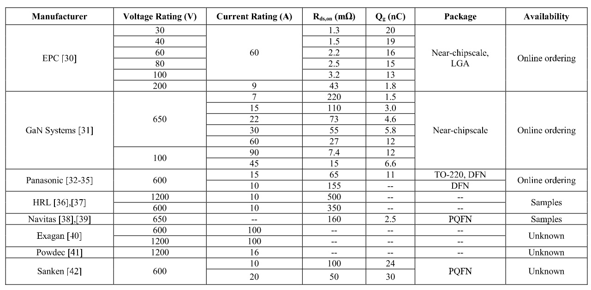
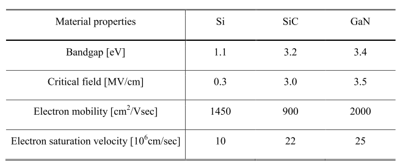
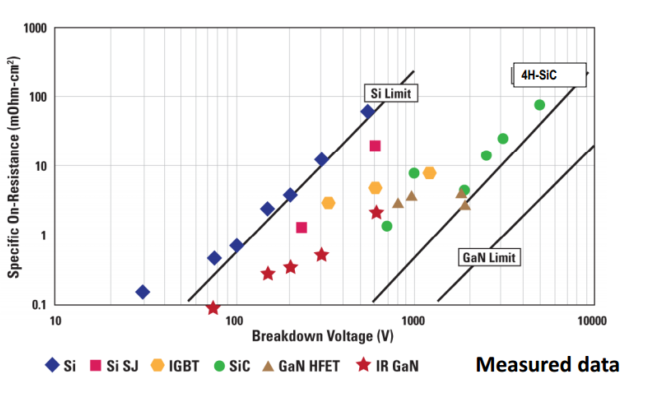
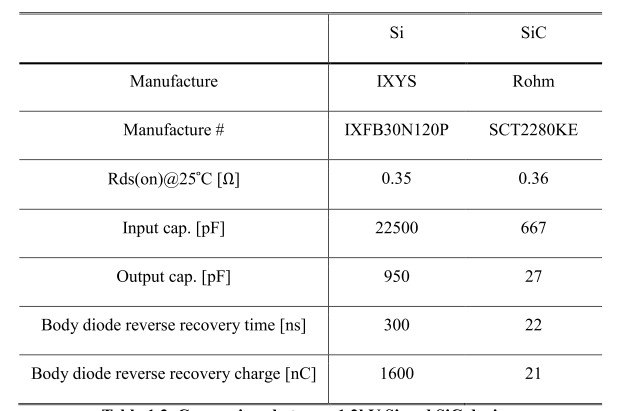
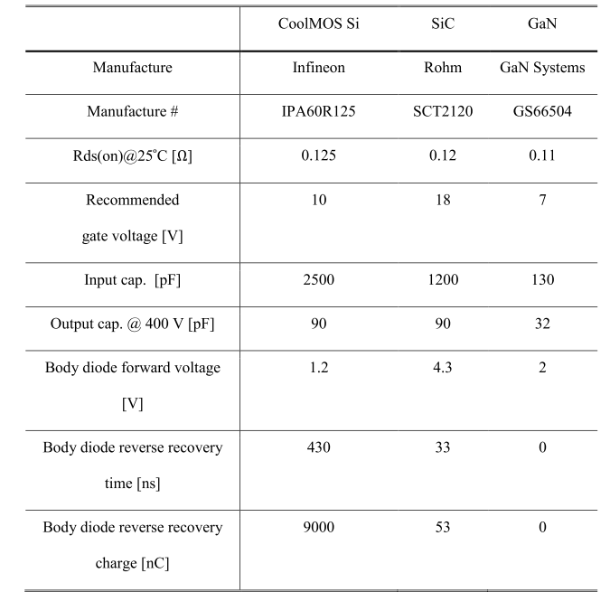

# Semiconductor devices

The table below shows the commercially available cascode GaN manufacturers.

The table below shows the commercially available enhancement mode GaN manufacturers.

# Wide band-gap devices
Material properties-I:

Material properties-II:

* For normal Si semiconductor, the operating temperature cannot be high because of the significant leakage current
* The higher critical field will allow a higher breakdown voltage for identical epitaxial thickness.
* The SiC and GaN devices can reach very low resistance.
* Since GaN have largest electron mobility, it should ultimately be the best material for high frequency operation
* The thermal conductivity of SiC is better than Si and GaN.
* BFoM: Baliga‘s figure of merit: a measure of the on-resistance of a unipolar device. Higher value means a lower Ron.

Specific on-resistance vs breakdown voltage:

# Existing WBG devices

* SiC schottky diode: The SiC schottky diodes with rating voltage up to 1.7 kV are available. The operating temperature can e as high as 200 C.

* SiC FET: Rating voltage up to 1.7 kV are available. CoolMOS (Si technology) may compare, but their ratings are up to 900V. Have very low Ron.

Switching performance comparison of Si and SiC FET devices having similar Ron:

* GaN FET: Use of Si substrate is more suitable for commercial products (due to cost). Depletion mode GaNs are normally-on (not desirable). Enhancement mode are normall-off. Cascode solution can be used as shown below:

* WBG IGBT: IGBT is bipolar where MOSFET is unipolar, thus IGBTs have smaller Ron. But, IGBT has on-state voltage drop.

# Comparison Between CoolMOS Si, SiC and GaN
## Comparison of device datasheet values

## Loss comparison

## Comments on comparison:
* Similar Rds-on: Similar conduction Loss
* GaN has lowest capacitances: Lower switching loss
* SiC is better than Si in capacitances (switching loss)
* Negligible gate driver loss
* GaN has no reverse recovery. Only conduction loss in diode (very low)
* SiC has better diode loss than Si

# Critical datasheet parameters for GaN:
Example: EPC2012 http://epc-co.com/epc/Portals/0/epc/documents/datasheets/EPC2018_datasheet.pdf

## Values
* Vds - Breakdown voltage: 150V
* Idc - Continuous current: 12 A (this should be provided with temp)
* Idp - Pulsed current: 60 A (this should be provided with temp and pulsewidth)
* Rdson - On-state resistance: 18 mOhm (this should be provided with Id, Vgs and temp)
* Vgs - Gate-source voltage: -5 to 6V (negative supply is required)
* Qg - Total gate charge: 5 nC (this should be provided with Vgs, Vds and Id)
* Qoss - Output charge: 40 nC (this should be provided with Vds and Id)
* Vf - Forward voltage: 1.8 V (source - drain, body diode) (this should be provided with Isd, Vgs and temp)
* Qr - Recovery charge: 0 nC (source - drain, body diode, zero for GaN)
* Thermal resistances: Rjc, Rjb, Rja

## Graphs
* Id vs Vds (Vgs)
* Ig vs Vgs (temp)
* Rdson vs Vgs (temp - Id)
* C vs Vds
* Isd vs Vsd (temp)
* Rdson vs temp
* Ig vs Vgs
* Transient thermal response
* Safe operating area

## Properties due to parameters
* Low Rdson: Low conduction loss
* Low Qg: High switching speed (nsec)
* Zero Qr: No recovery loss. Very low loss during dead time.
