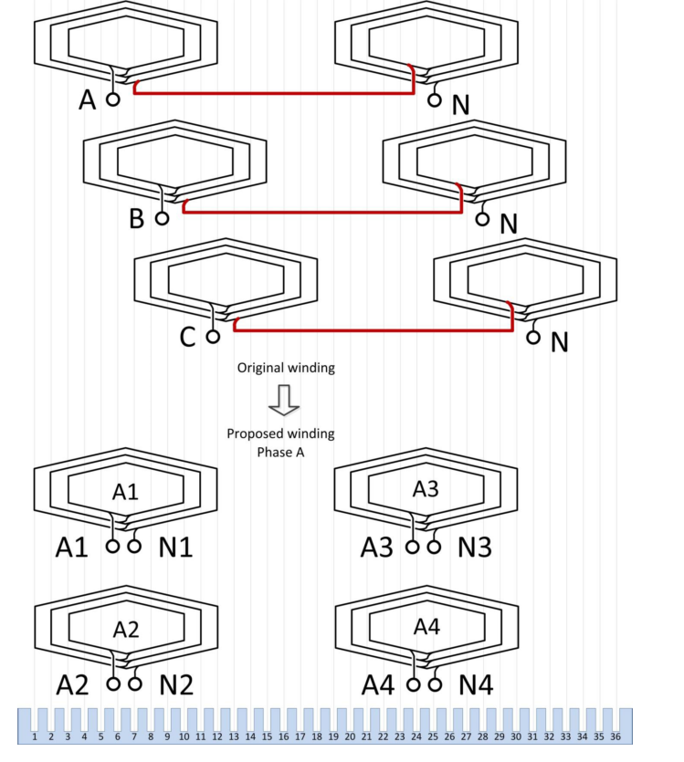
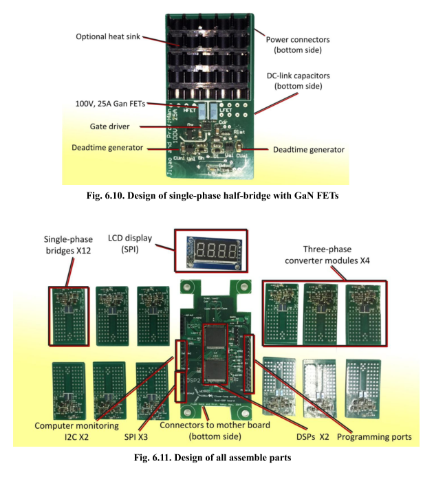
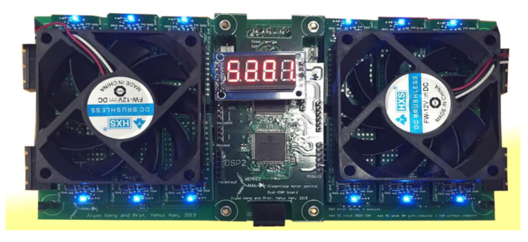
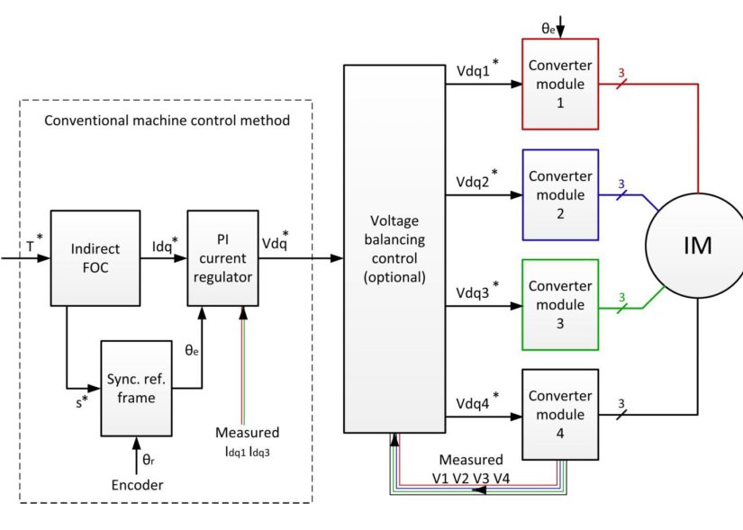

# Practical considerations in prototype design
* Central controller or distributed controller.
* May be a mother board to combine all the modules or each module may be assembled separately.

# PCB Considerations
* As the PCB gets smaller, the routing of PCB traces becomes very difficult to realize a circular shape design and meanwhile maintain low parasitic inductances.
* Half bridge should be a building block for modularity. Will be better in terms of parasitic inductance, switching performance and heat dissipation.
* An example of modularity is shown:

# Prototype test stages
* Test with RL load at steady state
* Test with RL load at with transients
* Test with a rewounded motor
* Test with a designed motor
* Rewound example:

* LC filter for PWM mismatch

# Circuit components:
* Half bridge X phase X module. If there are three phases and 4 modules, there will be 12 half bridges.

GAN: http://epc-co.com/epc/Portals/0/epc/documents/datasheets/epc2001c_datasheet.pdf
* Dual gate driver for each.

DRIVER: http://www.ti.com/lit/ds/symlink/lm5113.pdf
* Heat sink, Fan
* DC link capacitor for each
* One controller card with DSP (enough number). Display. Communication interface. Programming port. Encoder. ADC inputs.

An example is shown:

* Motherboard where all componenets are assembled:

* An overall control algorithm (indifect field oriented control):

